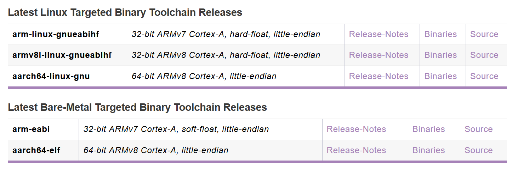
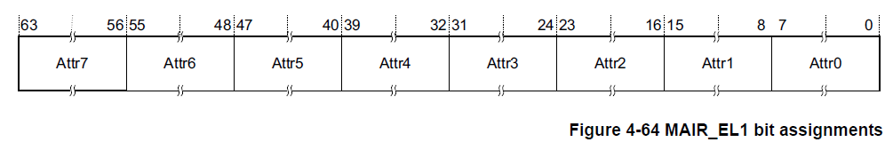
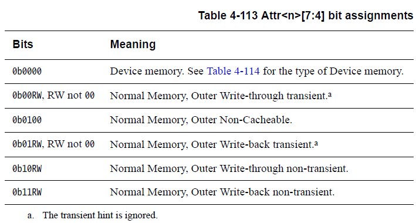
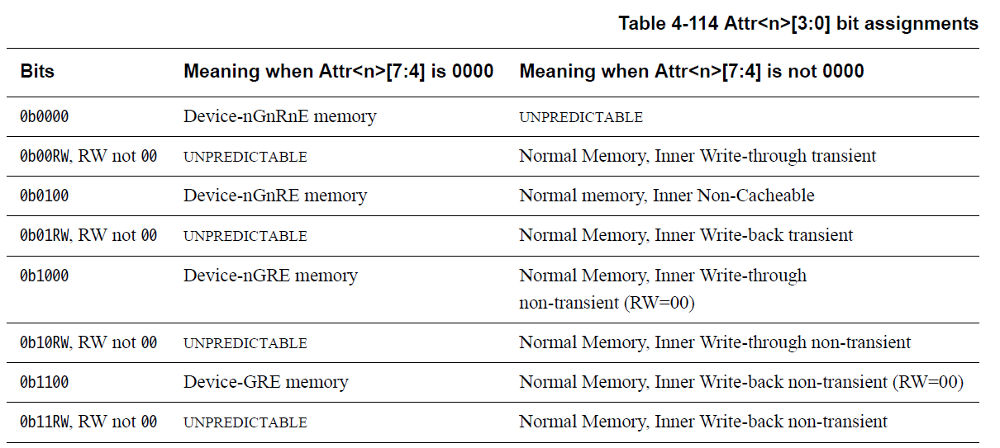
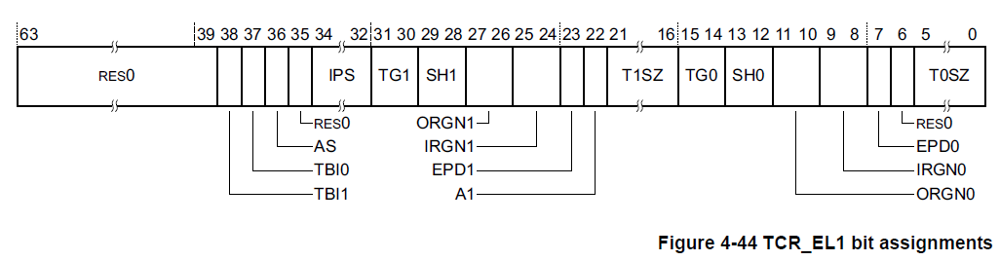
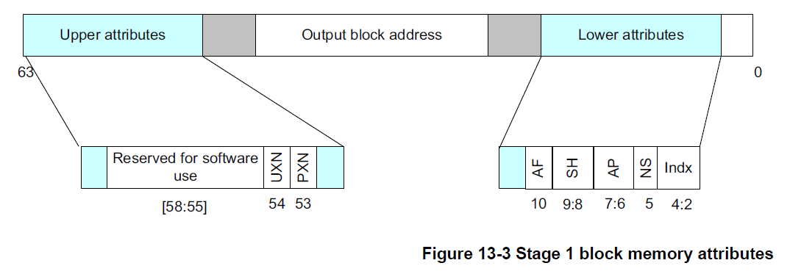
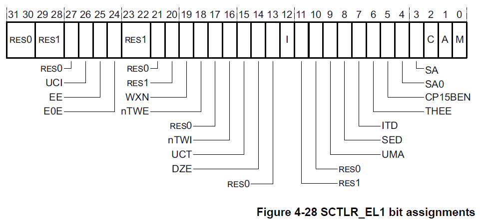

# 基于树莓派操作系统课程设计指导文档

## 序言

> 本文旨在阐述一种引导学生一步一步完成一个操作系统移植项目的过程。强调不仅能**对学生的完成情况进行考察**，还能让学生**体验到从零开始移植操作系统的乐趣**。

树莓派的实验引入操作系统课程设计中已经过了两年了，作为本书的撰写者，我认为树莓派的实验已经能够以一个较为成熟的姿态，提供一个同步于或者稍滞后与“标准”的MIPS实验的实验过程。当然这个实验能够做到什么程度，不仅仅是取决于撰写此书的人，而是阅读本书的各位。

## Lab0

### 基本认识

**树莓派（Raspberry Pi）**

本实验指定使用的硬件为树莓派第三代（型号3B）。树莓派是一种流行的硬件开发板，拥有庞大的社区资源。树莓派具有的硬件已经能完成本操作系统实验的全部能容，当然其本身就能够运行Linux操作系统。

**Aarch64**

树莓派3B使用的是一个ARM A53处理器，指令集为Aarch64（旧称ARMv8）。ARM的64位处理器都使用同一个指令集，但是又因为各系列的型号实现不同，需要参照不同的文档。这里给出两个主要参考的文档：

* ARM® Cortex®-A Series Programmer’s Guide for ARMv8-A
* ARM® Cortex®-A53 MPCore Processor Technical Reference Manual

前者是ARMv8指令集通用的程序员指导，后者是A53处理器的技术参考手册（实现细节）。

另外有趣的一点是现代的手机处理器几乎都是ARM体系结构的64位处理器，Aarch64的Linux内核开发已经十分成熟。作为题外话，你可以去了解一下这几个事实：

* 树莓派官方并不单独提供一个Aarch64的Raspbian（基于Debian的变种）Linux操作系统，提供的反而是一个兼容旧版的ARMv7的版本
* ARMv8和ARMv7的关系相当于amd64（x86_64）和i368（x86），他们的64位处理器均提供一种运行32位程序的方法
* 和x86不同的是，在设计上ARMv8和ARMv7设计迥异，一种很有趣的说法称ARMv8的设计更像是MIPS
* 除了手机之类的低能耗设备外，Aarch64已经逐渐渗透到高性能计算的服务器领域

### 实验环境搭建

树莓派实验鼓励学生自己动手搭建自己的实验环境。

**Host操作系统**

因为需要在你的操作系统上运行Aarch64的交叉编译器，而且一般来说目标机为64位的编译器也需要在64位操作系统上运行。这里给出两个建议的操作系统：

1. WSL (Windows Subsystem for Linux) 运行在Windows 10上
2. 一般的64位Linux发行版本（Ubuntu、openSUSE等）

WSL能够在Windows上运行64位的ELF可执行程序镜像，完成本实验绰绰有余。如果习惯使用Windows环境建议使用这种方式。对于macOS用户，可能需要自行安装GCC自行编译一个交叉编译器。

**内核编译器**

从一张图开始！



这里需要从两种编译器中选择一种来编译内核，答案显然是后者。请思考这几个问题：

* Linux Targeted 和 Bare-Metal 分别有怎样的含义呢？
* 为什么内核使用的编译器只提供软件浮点运算（soft-float）？
* 大小端的差异是由什么决定的？

回到正题，上图是Linaro的编译器下载页面的截图，你可以透过这个链接下载你需要的编译器二进制镜像或者源代码：https://www.linaro.org/downloads/

如果需要自行编译GCC交叉编译器，可以前往这个Github上的Repo获得一点帮助：https://github.com/dwelch67/build_gcc

**硬件仿真器**

诶？你可能会问这不是一个Bare-Metal的树莓派实验吗。实际上你不仅能够使用硬件仿真器模拟一个硬件处理器本身，还能模拟一个特殊硬件的外围设备。后文也会有使用真实树莓派硬件的指南。

此处实验使用的是当前master分支的QEMU。不久前合并的Patch使得QEMU能够仿真树莓派3B的处理器和部分外围，能够支持至少完成前6个实验（Lab0-Lab5）。在树莓派的实验中我们依赖的外围设备有：

1. UART串口通信
3. EMMC驱动（SD卡）

串口通信用于提供一个字符界面；EMMC驱动用于文件系统相关实验的扇区读写。

此处因为仿真器的实现限制，外部的系统时钟（BCM SoC Timer）并不能使用，所以你可能需要使用处理器内部的ARM的Generic Timer来完成系统计时器用于产生时钟中断进行进程切换，这一部分会在Lab3进一步说明。

如果你只使用的Windows操作系统，你可以从这里取得一份我们编译好的QEMU仿真器（因为Windows的QEMU建议在Linux中使用MINGW交叉编译）

如果你希望自行编译，请先取得QEMU的代码，在此之前你可能需要自行安装一些宿主机的工具链：

````bash
git clone https://github.com/qemu/qemu.git
cd qemu
./configure --target-list=aarch64-softmmu --enable-modules --enable-tcg-interpreter --enable-debug-tcg
make -jX
# X is the number of compile thread
````

**树莓派硬件**

你需要的硬件有：

1. 树莓派3B一只
2. FT232串口通信板一只（建议的型号）
3. MicroSD一张

树莓派使用的是Micro-USB的供电线，你可能需要一只USB接口的电源适配器和一根Micro-USB的线缆，你也可以使用电脑的USB接口供电（在树莓派不连接其他外设时，一般也不需要2.5A的电流）。

串口通信板你只需要连接地线`GROUND`（保证两端的电平差相同）和`TXD0`以及`RXD0` ，下图以Raspberry Pi 2B（3B与之相同）的示意图为例：


如果连接好线缆后，电脑端会出现串口设备而且一般情况也不需要另行安装驱动程序。

Windows下你仍可以使用PuTTY来连接串口设备，注意波特率的设置。

Linux下可以使用Minicom软件来连接串口设备（通过lsusb确认USB设备是否就位），一个典型的启动命令：

````bash
minicom -b 115200 -D /dev/ttyUSB0
````

其中`115200`为设置的波特率，`/dev/ttyUSB0`为一个字符设备（也就是串口通信板）。

以上就是Lab0的全部内容，这一步部分你不需要提交实验报告。


## Lab1 启动

现代微系统的启动过程一般情况下都十分复杂，以一个典型的启动过程为例：

1. 系统上电，复位
2. PC指向BIOS程序初始位置
3. BIOS完成硬件初始化，读取磁盘将系统移交给磁盘的引导记录上的程序段（一般称为Bootloader）
4. Bootloader读取磁盘，加载需要启动的操作系统的内核到内存中
5. Bootloader将系统移交给操作系统内核

近几年兴起的UEFI固件意图通过取代BIOS，能够极大的简化操作系统内核加载的过程。作为题外话，你可以研究一下这种新型的固件能够对操作系统启动部分的开发带来什么样的改变？

非常幸运的是树莓派没有这种如此繁复的过程，因为大部分的固件都不集成在树莓派的开发板上，而是以文件的方式写入在SD卡上，给出一个最简化的文件列表：

1. bootcode.bin 用于辅助CPU启动的GPU程序二进制镜像
2. config.txt 纯文本的内核启动配置
3. fixup.dat 固件的修补
4. start.elf GPU的内核ELF镜像
5. kernel8.img 需要加载的内核

随附件我们会提供经过验证可用的固件版本。

config.txt的内容如下，其目的是将树莓派启动到Aarch64的EL2（异常级别-2）状态，同时识别并加载文件名为kernel8.img的内核镜像。

````bash
arm_control=0x200
````

> Pi3 在发布初期使用的固件（包含 bootcode.bin, config.txt, start.elf）在启动时需要添加 kernel_old 设置，且是从 0x00000000 开始的内核 text 起始位置。然后在固件版本更新后，就不再需要这一设置，内核的 text 的起始位置也变成了 0x00080000，同时新增了一个文件 fixup.dat

此处我们会提供一个点亮机器用的内核镜像，用来验证你手头的硬件或者相关文件配置没有问题。如果正确加载后会启动树莓派UART串口，并打印出`Hello World!`并进入一个输入回显的状态。

如果你使用的是真实硬件，你需要将上述的5个文件拷贝到以FAT文件系统格式化的SD卡的根目录中，连接好串口通信的线缆，上电。

如果你使用的是QEMU，你仅需要将kernel8.img文件放置在一个特定目录，并在该目录下执行：

````bash
qemu-system-aarch64 -M raspi3 -serial stdio -kernel kernel8.img
````

`-M raspi3` 意图在于指定仿真的硬件为树莓派3B，`-serial stdio` 意图在于将树莓派的UART0导向到仿真终端的标准输入输出，`-kernel kernel8.img` 意图在于让仿真器加载指定文件名（kernel8.img）的内核镜像（QEMU能够直接加载ELF镜像或者RAW的二进制镜像）。

在后面的实验中加上 `-drive file=sdcard.img,format=raw` 参数可以模拟仿真器中的SD卡。

或许细心的你已经发现树莓派官方的Raspbian系统的第一个FAT分区内装入的是一个名为kernel7.img镜像，那是一个Aarch32（ARMv7）的32位Linux内核。回到上面的问题，不是说操作系统内核应该是由Bootloader来进行装载的吗。树莓派的内核开发并不是基于Linux的ARM分支进行的，他们Fork出了一个自己的分支，同时GPU的启动CPU时，能够直接加载一个“巨大”的Linux内核。那么是否能在树莓派上运行一个常规的Aarch64的Linux操作系统呢？答案是肯定的，你可浏览一下这篇文章 https://www.suse.com/docrep/documents/a1f0ledpbe/UEFI%20on%20Top%20of%20U-Boot.pdf

接下来，你就需要自行实现你的内核啦！在这里大概列出一个TODO清单：

* 确定要移植的文件清单
* 修改Makefile、配置交叉编译工具链
* 修改链接脚本Link Script
* 实现UART驱动，替换字符输出相关的代码
* 撰写启动用的汇编代码

>正如前面所提到的，树莓派3B使用的是一个四核心的处理器。首先明确一个概念，拥有多个核心的处理器每个核心拥有自己的一组寄存器，Cache 各级的共用情况不同，主存是共用的。按照推断，当内核镜像载入到主存后，四个核心都从同样的 PC 开始执行，若不做处理，在遇到对主存互斥的访问时会出现不可预知的问题。请寻找解决这一问题的方法。

虽然这是一个号称Bare-Metal的实验，但是其重点并不在于实现硬件驱动，这里提供简单的初始化UART以及一个输出字符所需要的代码（这一驱动实现的源码来源：https://github.com/bztsrc/raspi3-tutorial/tree/master/05_uart0）。

````c
#define UART0_IBRD      ((volatile u_int*)(0x3F201024))
#define UART0_FBRD      ((volatile u_int*)(0x3F201028))
#define UART0_LCRH      ((volatile u_int*)(0x3F20102C))
#define UART0_CR        ((volatile u_int*)(0x3F201030))
#define UART0_ICR       ((volatile u_int*)(0x3F201044))
#define GPFSEL1         ((volatile u_int*)(0x3F200004))
#define GPPUD           ((volatile u_int*)(0x3F200094))
#define GPPUDCLK0       ((volatile u_int*)(0x3F200098))
#define UART0_DR        ((volatile u_int*)(0x3F201000))
#define UART0_FR        ((volatile u_int*)(0x3F201018))

void uart_init() {
    register unsigned int r;
    *UART0_CR = 0;
    r = *GPFSEL1;
    r &= ~((7 << 12) | (7 << 15)); // gpio14, gpio15
    r |= (4 << 12) | (4 << 15);    // alt0
    *GPFSEL1 = r;
    *GPPUD = 0;            // enable pins 14 and 15
    r = 150;
    while (r--) { asm volatile("nop"); }
    *GPPUDCLK0 = (1 << 14) | (1 << 15);
    r = 150;
    while (r--) { asm volatile("nop"); }
    *GPPUDCLK0 = 0;        // flush GPIO setup
    *UART0_ICR = 0x7FF;    // clear interrupts
    *UART0_IBRD = 2;       // 115200 baud
    *UART0_FBRD = 0xB;
    *UART0_LCRH = 0b11 << 5; // 8n1
    *UART0_CR = 0x301;     // enable Tx, Rx, FIFO
}

void uart_send(unsigned int c) {
    do { asm volatile("nop"); } while (*UART0_FR & 0x20);
    *UART0_DR = c;
}
````


这一部分需要你提交一份记录了**你的主要工作** 的实验报告。


## Lab2 MMU

>  这个实验的重点在于把MMU启动起来，因为在机组实验中并没有实现一个MMU（甚至连TLB都没有），这部分接触的知识更多的是理论上的。而从一般的工程实践来看，这里需要强调学生阅读处理器的设计文档的能力，提供现成的代码会造成一种带来负面影响的依赖。我们的目标是要能够让所有的代码都能有根有据，而不是一堆莫名奇妙的设定。分页管理并不像常规的外设IO的驱动，而是内核与处理器相关性很强的一部分。

在启动树莓派处理器的MMU时，你可以感受到现代处理器的硬件设计的复杂与强大！

这里先给出一个简单的TODO清单：

1. 确定需要引入的文件清单
2. 设置间接内存属性寄存器（MAIR_EL1）
3. 设置翻译控制寄存器（TCR_EL1）
4. 准备内核用的页目录
5. 设置页表基地址寄存器（TTBR*_EL1）
6. 设置系统控制寄存器（SCTLR_EL1）
7. 修改启动代码，从EL2回落到EL1
8. 改写链接脚本

对于相关寄存器的设置，我们的建议是请仔细查阅文档来完成**你自己的**MMU设置，你甚至可以设置自己的页表级数、页面大小。通常来说Aarch64处理器会忽略最高的一字节（`[63:56]`）的地址翻译，而一般实际可用的物理地址线也只有40根。

一般来说越高的异常级别拥有越高的权限，而一般的无虚拟化的操作系统是运行在EL1下的，而很显然是不可能在EL1或者更低的异常级别设置EL1的处理器相关设置，这也是为什么是上电启动到EL2的原因。

#### MMU 设置（仅供参考）

这里给出一个MMU的设置过程例子，请设计并实现自己的内存地址翻译方案。

**Step 1 设置间接内存属性寄存器**

Memory Attribute Indirection Register, EL1

Purpose: Provides the memory attribute encodingscorresponding to the possible AttrIndx values in a Long-descriptor formattranslation table entry for stage 1 translations at EL1.

简言之就是用这个通过设置这个“数组”的内容，往后的地址翻译中的页表标志位则是根据这个表的下标（AttrIndx）来定位。

（ARMCortex-A53 MPCore Processor Technical Reference Manual 4-109）



这个“数组”寄存器一共提供了8组，也就是能设置8种类型的内存。每一个设置项有8位，其设置的位参考：





其中RW两位指的是cache的读时分配（read-allocate）和写时分配（write-allocate）。

一些概念的说明：

1.        inner和outer指的是多核心下的问题，此处不需要考虑，内外相同即可；


2.        transient和non-transient为cache的存留时间问题，此处不需要考虑，都设置为non-transient（cache内容更倾向于长时间驻留）；
3.        Write-through和Write-back是cache的写策略，分别是写通达和写回，都设置为Write-through；
4.        GRE指的是设备内存区域访问的三种特性，A53中“仅有”nGnRE和GRE，一般对于外设的IO设置为nGnRE；

此处我们设置3种类型：

| #    | AttrIndx | Attr<n>[7:4] | Attr<n>[3:0] | 用途            |
| ---- | -------- | ------------ | ------------ | --------------- |
| 1    | 0        | 0b1000       | 0b1000       | 普通内存        |
| 2    | 1        | 0b0000       | 0b0100       | 设备，nGnRE     |
| 3    | 2        | 0b0100       | 0b0100       | non-cache的内存 |

计算得到的mair_el1寄存器值：`0x440488`

````assembly
msr mair_el1, #0x440488
````

页表项的标志位中则可以定义这三种内存类型的宏：

````c
#define PTE_NORMAL (0 << 2)
#define PTE_DEVICE (1 << 2)
#define PTE_NON_CACHE (2 << 2)
````

**Step 2 设置翻译控制寄存器**

Translation Control Register, EL1

Purpose: Determines which Translation Base Registers definesthe base address register for a translation table walk required for stage 1translation of a memory access from EL0 or EL1 and holds cacheability andshareability information.

（ARMCortex-A53 MPCore Processor Technical Reference Manual 4-81）

简言之就是设置地址翻译过程的设置寄存器。



| 位      | 值    | 说明                  | 位      | 值   | 说明                  |
| ------- | ----- | --------------------- | ------- | ---- | --------------------- |
| [38]    | 1     | 忽略最高的一字节      | [23]    | 0    | 使用TTBR1_EL1         |
| [37]    | 1     | 忽略最高的一字节      | [22]    | 0    | TTBR0_EL1使用ASID     |
| [36]    | 0     | 8-bit ASID            | [21:16] | 0d25 | *25位高地址掩码Kern   |
| [35]    | 0     | 保留                  | [15:14] | 0b00 | 4KB页面大小User       |
| [34:32] | 0b000 | 32-bit物理内存总线    | [13:12] | 0b11 | *Inner Shareable User |
| [31:30] | 0b10  | 4KB页面大小Kern       | [11:10] | 0b10 | *Cacheability O/User  |
| [29:28] | 0b11  | *Inner Shareable Kern | [9:8]   | 0b10 | *Cacheability I/User  |
| [27:26] | 0b10  | *Cacheability O/Kern  | [7]     | 0    | 使用TTBR1_EL0         |
| [25:24] | 0b10  | *Cacheability I/Kern  | [6]     | 0    | 保留                  |
|         |       |                       | [5:0]   | 0d25 | *25位高地址掩码Kern   |

约定使用TTBR1_EL1用于内核的地址空间（高位），TTBR0_EL1用于用户进程的地址空间（低位）。

一个三级页表设计（64-25=39位VA）

| 63           40 | 39         31 | 30        21 | 20         12 | 11          0 |
| --------------- | ------------- | ------------ | ------------- | ------------- |
| 高位掩码25’     | 三级页表9’    | 二级页表9’   | 一级页表9’    | 页内偏移12’   |

计算得到的tcr_el1寄存器值：`0x60BA193A19`

````assembly
msr tcr_el1, #0x60BA193A19
isb
````

按*：ISB指令用于清空处理器流水线中的指令，在进程切换，更新TLB设置等操作时需要保证修改效果能够生效。

**Step 3 准备内核页目录**

1.        首先分配一个页面的空间`boot_alloc`，并且清空`boot_bzero`；
2.        首先需要将所有的物理内存和MMIO（设备占用的地址空间）映射`boot_map_segment`到内核使用的页表中：

因为不可避免的（照顾到32位系统），所以有大约16MB的内存牺牲给了设备占用的地址空间（`0x3F00 0000 ~ 0x3FFF FFFF`）；这时将`0x00000000 ~ 0x3EFF FFFF`的物理内存映射为普通内存（`PTE_NORMAL`），将设备地址空间映射为设备（`PTE_DEVICE`）。

同时需要实现一个函数`boot_pgdir_walk`以便为各级页表分配物理内存空间。

（ARMCortex-A Series Programmer’s Guide for ARMv8-A 13-11）



给出一些页表的标志位：

````c
#define PTE_PAGE 0b11 //4KB的粒度（同理有其他粒度）
````

AP(Access Permission)标志位[7:6]

````c
#define PTE_KERN (0 << 6) // 仅EL1+访问
#define PTE_USER (1 << 6) // EL0+可访问
#define PTE_RW (0 << 7) // 读写
#define PTE_RO (1 << 7) // 只读
````

AF(Access Flag)标志位[10]

````c
#define PTE_AF (1 << 10) // *用户控制的可访问标识（AccessFlag）
````

PXN/UXN标志位[53]/[54]

````c
#define PTE_PXN (1UL << 53) // 不可执行标记（PrivilegedExecute-Never）
#define PTE_UXN (1UL << 54) // EL0不可执行标记（Unprivileged Execute-Never）
````

Indx MAIR中的AttrIndx [4:2]

SH 共享标记

````c
#define PTE_OUTER_SHARE (2 << 8) // 外部共享（核心Cluster间）需要给设备内存标记
#define PTE_INNER_SHARE (3 << 8) // 内部共享（Cluster内）需要给普通内存标记
````

按：用户控制的可访问标识相当于一个不强制的标识位与标准实验中的PTE_V不同，控制位会导致缺页中断，但是并不会真的影响是否能存取，仅会影响TLB行为和异常行为。

**Step 4 设置页表基地址寄存器**

Translation Table Base Register 1, EL1

````assembly
msr ttbr1_el1, KSTACKTOP
````

建议一开始将ttbr0_el1也设置为同样的页目录地址，方便初始化。

**Step 5 设置系统控制寄存器**

System Control Register, EL1

Purpose: Provides top level control of the system, includingits memory system at EL1.

简言之是总的控制处理器行为的寄存器。

（ARMCortex-A Series Programmer’s Guide for ARMv8-A 4-50）



| 位   | 值     | 位   | 值     | 位   | 值     | 位   | 值     |
| ---- | ------ | ---- | ------ | ---- | ------ | ---- | ------ |
| 31   | 0 保留 | 23   | 1 保留 | 15   | 0 X*   | 7    | 0 X*   |
| 30   | 0 保留 | 22   | 1 保留 | 14   | 0 X*   | 6    | 0 保留 |
| 29   | 1 保留 | 21   | 0 保留 | 13   | 0 保留 | 5    | 1 X*   |
| 28   | 1 保留 | 20   | 1 保留 | 12   | 1 I*   | 4    | 0 SA0* |
| 27   | 0 保留 | 19   | 0 WXN* | 11   | 1 保留 | 3    | 0 SA*  |
| 26   | 0 X*   | 18   | 1 X*   | 10   | 0 保留 | 2    | 1 C*   |
| 25   | 0 EE*  | 17   | 0 保留 | 9    | 0 UMA* | 1    | 0 A*   |
| 24   | 0 E0E* | 16   | 1 X*   | 8    | 0 X*   | 0    | 1 M*   |

X*：不予说明；

EE*：EL1及页表尾端little Endian（0）；

E0E*：EL0尾端little Endian（0）；

WXN*：可写区域不可执行，并不启用这一特性（0）；

I*：指令Cache启用（1）；

UMA*：禁止用户态访问中断屏蔽寄存器（0）；

SA0*：禁用EL0的栈对齐检查（0）；

SA*：禁用栈指针SP的对齐检查（0）；

C*：启用数据cache（1）；

A*：禁用对齐检查（0）；

M*：启用MMU（1）。

计算得到sctlr_el1寄存器的值：`0x30d51825`

````assembly
msr sctlr_el1, #0x30d51825
isb
````

**Step Finish 完成**

做完上述过程树莓派的MMU就已经可以启动啦，之后通过将地址设置为高位来访问设备的地址空间。同时这里也需要将main函数链接到一个高地址位置。

 

在启动前可能需要排除一些问题，树莓派启动时不一定处于EL1状态，甚至会出现EL3的状态。对于我们这个不涉及虚拟化的操作系统实验只会使用到EL0和EL1状态。需要在启动时回落到EL1状态。

对于回落到EL1的过程，这里给出一段参考代码，但是不保证能够达到你的期望效果，请仔细查阅相关处理器文档做出合适的修改并应用在你的代码中：

````assembly
2:  ldr x1, =0x80000
    mov sp, x1
    bl vm_init
    mrs x0, currentel
    cmp x0, #4 // EL1?
    beq _el1_start

    // EL2 TO EL1
    ldr x0, =0xFFFFFF8000080000
    msr sp_el1, x0 // set stack pointer of el1
    
    mov x0, #0x33ff
 
    msr cptr_el2, x0
    msr hstr_el2, xzr // disable trap of coprocessor
    mov x0, #3 << 20
 
    msr cpacr_el1, x0
    
    mov x0, #(1 << 31)
    msr hcr_el2, x0 // set el1 to aarch64
 
    mov x0, #0x0800
    movk x0, #0x30d0, lsl #16
    msr sctlr_el1, x0 // initial sctlr value of el1
    
    mov x0, #0x5
    msr spsr_el2, x0 // eret copy spsr to pstate
    adr x0, _el1_start
    msr elr_el2, x0 // set address of eret
    eret

_el1_start:
	// set registers above and branch main

````

`SPSR_EL*`寄存器和处理器状态寄存器`PSTATE`内容相同，它包含一些运行状态的设置和**中断屏蔽**， 你可能会在后续的实验中对它进行更多的设置。

> ARM的内核地址空间一般是高内存地址空间，但是实际上并不存在那么大的物理内存空间，所以也不能在装入内核时试图直接将内核装入在高内存位置（因为也不存在类似于MIPS的直接映射区域），这种时候你需要自己设计一种解决方案，使得内核能够“正确”链接，并在MMU启动后能够在高地址空间可运行。如果你不能做到这个方案也无妨接下来的实验，你也可以直接将使用`TTBR0_EL1`作为内核用的地址空间，而用户程序使用高地址空间。

这一部分需要你提交一份记录了**你的主要工作** 的实验报告。


## Lab3 用户进程

在这一个Lab中你会了解ARMv8的异常模型，以及一个简单的用户程序使用系统调用输出字符。

### ARMv8 的异常模型

ARMv8共设计了4个异常级别（忽略Secure特性），分别是：

* EL0 用户的应用程序（用户态）
* EL1 操作系统内核（内核态）
* EL2 Hypervisor 虚拟化监视器（支持处理器核心的虚拟化）
* EL3 安全监视器，（支持安全状态）

在本操作系统实验中你仅需要使用到前两个EL。

一般而言处理器从用户态陷入内核态是需要一些条件的，比如内部因素的处理器异常（异常指令，对齐问题等）、特权指令（系统调用）、外部中断。而且处理器也设计了中断向量表来区分这各种因素，并跳转到一个指定的处理函数。在ARMv8中，处理器使用的中断向量表的一个例子（取自Linux内核`arch/arm64/kernel/entry.S`）如下：

````assembly
/*
 * Exception vectors.
 */
	.pushsection ".entry.text", "ax"

	.align	11
ENTRY(vectors)
	kernel_ventry	1, sync_invalid			// Synchronous EL1t
	kernel_ventry	1, irq_invalid			// IRQ EL1t
	kernel_ventry	1, fiq_invalid			// FIQ EL1t
	kernel_ventry	1, error_invalid		// Error EL1t

	kernel_ventry	1, sync				// Synchronous EL1h
	kernel_ventry	1, irq				// IRQ EL1h
	kernel_ventry	1, fiq_invalid			// FIQ EL1h
	kernel_ventry	1, error			// Error EL1h

	kernel_ventry	0, sync				// Synchronous 64-bit EL0
	kernel_ventry	0, irq				// IRQ 64-bit EL0
	kernel_ventry	0, fiq_invalid			// FIQ 64-bit EL0
	kernel_ventry	0, error			// Error 64-bit EL0

#ifdef CONFIG_COMPAT
	kernel_ventry	0, sync_compat, 32		// Synchronous 32-bit EL0
	kernel_ventry	0, irq_compat, 32		// IRQ 32-bit EL0
	kernel_ventry	0, fiq_invalid_compat, 32	// FIQ 32-bit EL0
	kernel_ventry	0, error_compat, 32		// Error 32-bit EL0
#else
	kernel_ventry	0, sync_invalid, 32		// Synchronous 32-bit EL0
	kernel_ventry	0, irq_invalid, 32		// IRQ 32-bit EL0
	kernel_ventry	0, fiq_invalid, 32		// FIQ 32-bit EL0
	kernel_ventry	0, error_invalid, 32		// Error 32-bit EL0
#endif
END(vectors)
````

这里的`kernel_ventry`是一个汇编宏`.macro kernel_ventry, el, label, regsize = 64` 。

如此列举的一共有4组的异常向量，简单的说用途分别是“不应该发生”、EL1异常陷入EL1处理、EL0异常陷入EL1处理、32位相关的陷入。在本实验中你可能需要填充中间的两组异常向量。

> 请思考什么时候会发生EL1异常并陷入EL1来处理EL1的异常的情况？

每组内各有4个跳转`label`，分别是Sync（同步错误）、IRQ（中断请求）、FIQ（快速中断）和Error（系统错误），后文再继续介绍它们的用途。

你可能注意到了向量的顶部有一个对齐的Assembly Directive `.align 11`  是期望这个向量的基地址的后11位为0，也就是2KB对齐。处理器设计也要求每个向量的代码`.text`也满足一定的对齐要求。

> 请查阅相关资料或代码，自行撰写一个满足对齐要求的简单的中断向量

完成中断向量后，需要将这个向量载入到`vbar_el1`寄存器中。

Sync 同步错误中包括了实验中常见的两类情况：1. 缺页错误（Page Fault）2. 系统调用（System Call）。处理器在设计时使用了一个`esr_el1`寄存器来更细节的描述一个异常的“症状”，在缺页错误中，寄存器`far_el1`会记录发生错误的虚拟地址。

> 请查阅 ESR_EL1 寄存器的设计，撰写区分缺页错误和系统调用的代码。

IRQ 中断请求中包括了时钟中断，后文将介绍一个使用内置时钟的方法。

FIQ在实验中可能是用不到的；Error会在一些指令违例等情况出现。

### 时钟中断

因为仿真器不具有使用博通SoC的时钟的功能，所以只能使用处理器内部的核心时钟，一般称为Generic Timer。

这种内部时钟可以使用系统寄存器存取的方式（msr/mrs）来控制（当然也可以使用内存空间总线的方式）。这里涉及的系统寄存器有：

* CNTP_CTL_EL0 控制寄存器
* CNTP_TVAL_EL0 计数寄存器
* CNTP_CVAL_EL0 比较寄存器
* CNTFRQ_EL0 时钟频率

一个参考的控制位设定（来源ARM内核驱动），其字面意思可以帮助理解含义：

````c
#define ARCH_TIMER_CTRL_ENABLE		(1 << 0)
#define ARCH_TIMER_CTRL_IT_MASK		(1 << 1)
#define ARCH_TIMER_CTRL_IT_STAT		(1 << 2)
````

一般的操作是向TVAL中填入一个值，则会触发一个Countdown的计数器模式，在启用控制寄存器后则会倒计时。如果期望的是一个具体的物理时间，则需要取出时钟频率寄存器的值，手动计算期望的寄存器的值。

> 请完成时钟相关的函数，并验证可用性。

你可以在启用计时器后轮询控制寄存器，观察其STAT位的值变化。当STAT为高位时，计时器处于异常状态。这个时候计时器的中断请求总线已经向中断控制器发出请求了，但是这个时候并没能观测到期望的时钟中断的软件过程。而很明显时钟内置的中断屏蔽位是0，问题可能出在树莓派的中断控制器的设置，或者处理器的状态位（DAIF）设置。

树莓派的中断控制器是一组内存总线上的寄存器，可以参照文档（<https://www.raspberrypi.org/documentation/hardware/raspberrypi/bcm2836/QA7_rev3.4.pdf>）

虽然这是树莓派2B的文档，但是大部分的内存IO总线上的寄存器和设备都是和树莓派3B相同的。

> 请寻找到合适的中断控制器设定，并启用时钟的中断。
>
> 在从EL2回落到EL1时，需要设置`spsr_el2`寄存器，寄存器的内容在异常返回（ERET）后会复制到PSTATE寄存器状态寄存器，请保证中断不被屏蔽。

到这里你应该可以看到期望的时钟中断的出现了。这里的时钟像是“一次性”的，并不会周期出现，你可以在每次调度进程后重启时钟的倒计时就能够实现进程的轮转了。


### 用户程序

这里需要你自行编译两个（一个输出a，一个输出b之类的）用户程序，并在内核启动时加载这两个程序。

这里提供一个简易的用户程序代码：

````c
int put_character(int no, char c) {
    __asm__ __volatile__ (
    "svc #0"
    );
}

int main() {
    while (1) {
        put_character(0, 'a');
    }
    return 0;
}
````

可以看到用户进程是通过SVC指令来陷入内核态的，这里仿照的是MIPS实验的系统调用格式，所以第一个参数是系统调用号。因为ARMv8的通用寄存器众多，参数可以都只使用寄存器传参。

可以直接用同样的工具链，将这个无任何依赖的C代码编译成ELF镜像，在链接时需要指定程序入口为main。

至于如何让内核载入用户的程序，这一点仅给出几个思路：

* 将ELF镜像转换成MIPS实验中的数组的形式
* 通过UART输入传送镜像
* 通过存取SD卡（需要实现SD卡相关的驱动）读取扇区


到此为止可能还需要一些剩余的工作TODO：

* 一个64位的ELF Loader（`kernel_elfloader.c`）
* 页表遍历的函数的修改（`env_free`）
* 现场保存和恢复
* TLB刷新
* ……


这一部分需要你提交一份记录了**你的主要工作** 的实验报告。

## Lab4 系统调用/进程通信

从这个实验开始，树莓派分支和MIPS分支的差异会越来越小。所以指导书会侧重于讲解一些中要的实现问题，而不是一个流程化的说明。

**一个完整的用户Fork的实现**

这里提到了“完整的”的这个概念，也就是说不希望用同等效用的其他实现方式来实现fork，主要的要点有：

1. 不应该实现一个内核的系统调用的fork（不增加系统调用）
2. 实现一种机制来遍历进程内存空间（类似于`vpd/vpt`的实现）
3. 实现一个由用户态处理自身进程的缺页中断的机制（Copy on Write机制的用户态实现）
4. 实现在用户态下恢复`Trapframe`并回到正常状态的机制

**应用程序访问自身页表** 

在MIPS实验中，为进程初始化虚拟内存有这样的代码：

````c
e->env_pgdir[PDX(UVPT)] = e->env_cr3 | PTE_V | PTE_R;
````

你可以尝试直接在树莓派中实现“类似”的自映射设计，并观察结果。

实际上，当尝试在用户态使用vpd指针访问页表的物理页时，是直接存取物理内存的（请在MIPS实验中观测这一点），直观的想，这种插入页目录的表项的行为至多能够使得页目录的物理页（4KB）能够直接存取，而其他的页表的物理页是不可能通过“合法”的方式访问的，因此这种设计是不可行的。

所以这里的建议做法是自行完成所有页表的物理页的用户地址空间映射。在不实现自映射设计时可以在用户空间为各级页表空间预留一个区域，如：

````c
#define UVPD                0x7040200000UL
#define UVPM                0x7040000000UL
#define UVPT                0x7000000000UL
````

将页目录的物理页映射到`UVPD`处：

````c
page_insert(e->env_pgdir, pa2page(PADDR(e->env_pgdir)), UVPD, PTE_USER | PTE_RO);
````

此处需要注意权限设置，用户是不应该具有写入页表的能力的。

>  接下来就是中间级页表空间和页表空间的映射问题了，请找到为页表申请物理页的位置，并在“当时”将物理页映射到合适的位置来访问。

在完成映射后就能够访问自身进程的页表空间了，和MIPS实验不同的是，这里实现的是每一个页面的映射，不再尝试访问页表项里的地址，所以可以通过类似这样的方式遍历地址空间：

````c
extern unsigned long *vpt, *vpm, *vpd;

for (i = 0; i < 512; i++) {
    if (vpd[i] == 0) continue;
    for (j = 0; j < 512; j++) {
        if (vpm[i * 512 + j] == 0) continue;
        for (k = 0; k < 512; k++) {
            pte = vpt[i * 512 * 512 + j * 512 + k];
            if (pte == 0) continue;
            va = (i * 512 * 512 + j * 512 + k) << PGSHIFT;
            // Do something here!
        }
    }
}
````

> 请思考这样的一个问题，如果通过增加一个系统调用来“查询”自身进程的页表项会带来哪些问题？从安全方面，代价方面考虑这个问题。


**COW的用户态处理**

当发生缺页中断时，系统陷入内核态，内核通过鉴别一个同步（`sync`）错误的种类，来捕获特定的缺页中断，进入一个内核的处理函数。

> 请查阅处理器文档，找到缺页中断对应的错误编号（Exception Class），并将缺页中断导向一个内核handle。

这里内核可以通过系统寄存器`far_el1`来获得发生缺页中断的地址，在进程为自身设置了`set_pgfault_handler`的前提下（也就是在`env`的`env_pgfault_handler`域非空），系统在判别这是不是一个尝试写入“只读”的COW页面的操作，如果是则需要直接通过设置`elr`和`sp`寄存器，分别为处理函数地址和异常处理栈指针（`XSTACKTOP`），使得此处能够返回到用户定义的缺页中断的处理函数。此处还需要传递发生缺页错误的地址信息。

用户进程设置了一个`__asm_pgfault_handler`的用户态处理缺页中断的过程。进入这一过程后，首先会调用`pgfault`函数，这个函数需要一个参数，也就是发生缺页中断的地址。从这一函数返回后则需要恢复进程原本的运行状态。


**用户态恢复Trapframe**

首先在内核捕获缺页时的Trapframe就应该是进程原本的运行状态，而异常返回后则会有信息被破坏。所以需要先行将Trapframe复制到一个“用户可见的“的位置，比如异常处理栈内：

````c
struct Trapframe *tf = (struct Trapframe *)(K_TIMESTACK_TOP - sizeof(struct Trapframe));
bcopy(tf, (void *) (U_XSTACK_TOP - sizeof(struct Trapframe)), sizeof(struct Trapframe));
````

> 这个时候需要将返回的栈指针设置到一个合适的位置。在返回用户态，并通过`pgfault`函数处理完COW复制后，请撰写一段汇编代码尝试恢复现场。


> 这里你可以观察MIPS实验的代码，恢复代码实现了一个”原子操作“，而这一特性的实现关键在于分支延时槽。但是很遗憾的是ARM设计并没有延时槽。同时因为受限于指令格式，不能直接通过`LDR`设置`pc/sp`寄存器，也就是必须使用一个数字编号的寄存器来作为”中间变量“，而这种做法也带来了新的问题。请查阅文档，利用一个”保留用途“的数字编号寄存器来完成这些操作。


进程通信部分不需要过多的说明，这一部分需要你提交一份记录了**你的主要工作** 的实验报告。


## Lab5 文件系统

在MIPS实验中，IDE磁盘驱动的实现是依赖于内核地址存取的，但是这并不是一种在树莓派上能够实现的方法。在树莓派上最接近文件系统的硬件是SD卡，而通常而言SD卡的总线控制和EMMC总线相同，你需要实现一个读取SD卡上的扇区的驱动，进而实现一个“磁盘驱动”。

如果你是用的是树莓派物理硬件，这里需要注意的是请尽可能得减少SD卡的插拔的读写以防止硬件的损坏。同时因为SD卡的头部是一个FAT分区，实验的文件系统分区并不能写入到SD卡的头部，你可以设定一个固定偏移来读取一个扇区。在写入SD卡时，给出一个参考的命令：

````bash
dd if=fs/fs.img of=[block device of sdcard] seek=10000
````

**这里需要警示的是`dd`可是号称Disk Destroyer的内置命令，请在使用该命令时保持极度的谨慎！**上面的语句的作用是将文件`fs.img`，写入到一个块设备如`/dev/sda` **（此处仅为举例，请找到SD卡对应的块设备文件）**的指定扇区偏移位置`10000` 。

如果你使用的是仿真器，那仅需要将上述的块设备文件替换成一个SD卡镜像文件，如：

````bash
dd if=fs/fs.img of=sdcard.img seek=10000
````

在使用仿真器加载时，需要添加参数`-drive file=sdcard.img,format=raw`。此处的扇区偏移不是必须的，因为内核读取并不依赖于FAT分区，你可以直接将`fs.img`放在`sdcard.img`的头部，或者直接使用`fs.img`作为磁盘镜像。

> Windows系统下的WSL并没有USB块设备的文件描述符实现，所以如果你使用的是Windows操作系统而又希望写入物理SD卡，你可以尝试使用dd for windows （http://www.chrysocome.net/dd）。这里没有任何保证，请谨慎操作。

至于如何在用户态下访问设备IO的地址空间这里给出两种典型的方案：

> 1. 将设备的地址总线的页面映射到文件系统服务进程的地址空间上，并在用户程序实现一个用户态的硬件驱动。
> 2. 实现一个系统调用，在内核中实现硬件驱动，并读取扇区，写入到用户进程的地址空间上。
>
> 请讨论这两种实现方案的优缺点，从安全性和微内核设计原则两个角度。

至于具体的EMMC驱动的实现，请自行（在借助他人的代码的帮助下）完成即可。通常而言，驱动实现的写入扇区机能是无法保证的，在本文件系统实验中，你可以直接舍弃掉所有的脏回写。

这一部分需要你提交一份记录了**你的主要工作** 的实验报告。

## Lab6 Shell

这里需要实现的是一个命令行的外壳接口，做到这一步已经属于树莓派移植的“未知领域”了。当然这里需要的已经没有因为任何硬件/体系结构相关的设计变更了，这也并不意味着这个移植工作会很简单，所以请让我看到你的最终的工作成果吧！

这一部分需要你在最终的**申优答辩**中展示，不需要提交实验报告。

## 后记

TODO